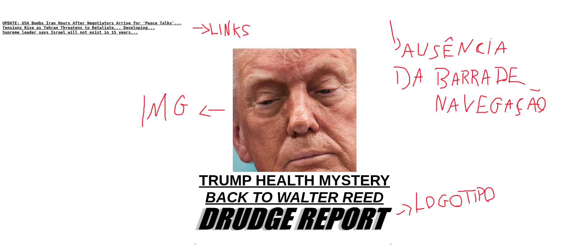
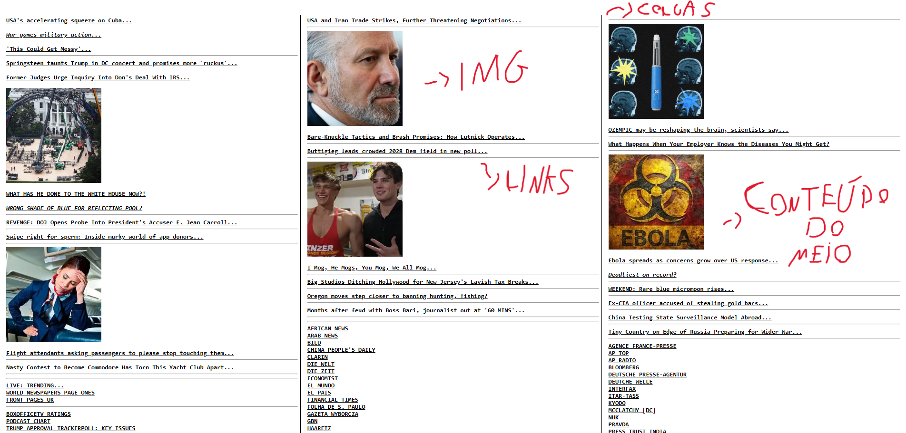
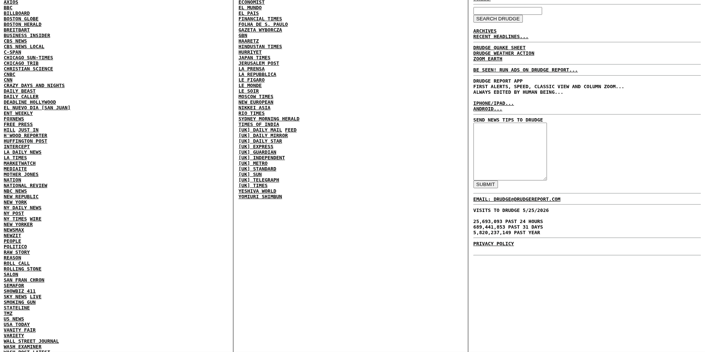
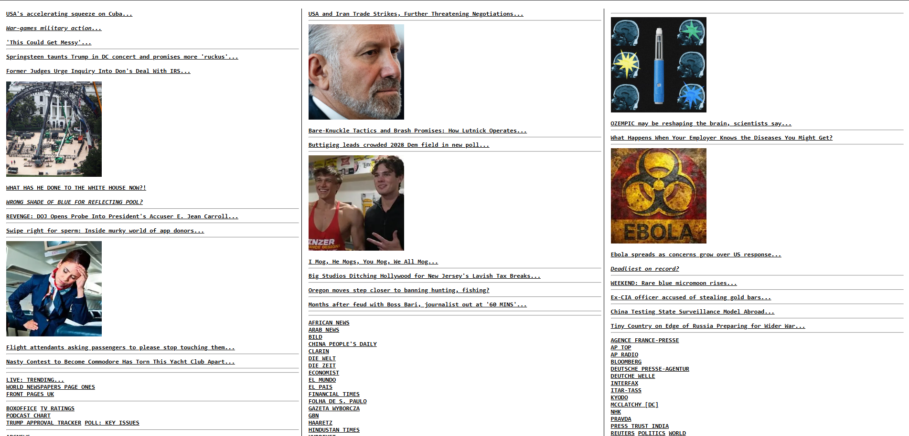
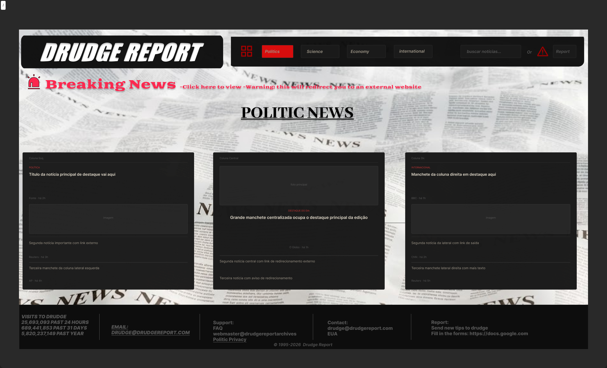
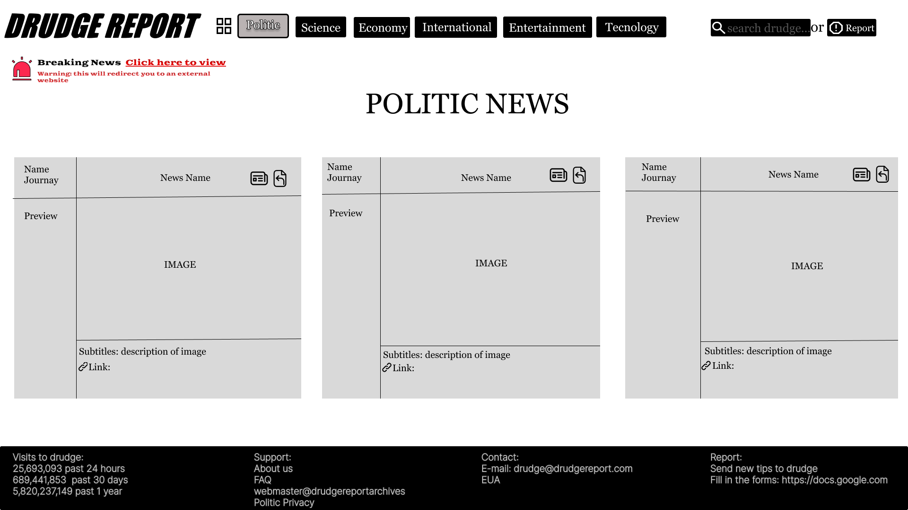

# Redesign Drudge Report — Avaliação Heurística e Proposta de Solução

Estudo de caso prático de UI/UX Design aplicado ao website **Drudge Report** (drudgereport.com), desenvolvido como atividade avaliativa da disciplina de UI/UX Design — UNINASSAU. O projeto envolveu avaliação heurística individual, consolidação em relatório de grupo e proposta de redesign em média fidelidade.

---

## 📋 Sobre o Projeto

O **Drudge Report** é um portal de notícias norte-americano com mais de 25 milhões de acessos diários. Lançado nos anos 1990, o site mantém até hoje uma interface datada, sem menu de navegação, sem hierarquia visual e com sérios problemas de usabilidade.

Este projeto teve três etapas principais:

**1. Avaliação Heurística Individual**
Cada integrante do grupo avaliou o site de forma independente, identificando violações às [10 Heurísticas de Nielsen](https://www.nngroup.com/articles/ten-usability-heuristics/), classificando os problemas por grau de severidade (0–4) e propondo recomendações de melhoria.

**2. Consolidação em Relatório de Grupo**
Os registros individuais foram unificados em um relatório de grupo, com síntese dos problemas mais recorrentes, graus de severidade consensuais e recomendações gerais de redesign.

**3. Proposta de Redesign**
Com base nos problemas mapeados, o grupo desenvolveu uma proposta de redesign em **média fidelidade**, partindo de wireframes feitos à mão até uma versão digital no Figma — preservando a identidade do site original e corrigindo as principais falhas de usabilidade identificadas.

---

## 👥 Avaliadores

| Avaliador | Papel |
|-----------|-------|
|  | Avaliador 1 |
|  | Avaliador 2 |
|  | Avaliador 3 |

---

## 🔍 Heurísticas Violadas

O grupo identificou violações em **7 heurísticas de Nielsen**, listadas abaixo com grau de severidade:

| Nº | Heurística | Severidade |
|----|-----------|-----------|
| H2 | Compatibilidade com o Mundo Real | ●● |
| H3 | Controle e Liberdade do Usuário | ●●● |
| H4 | Consistência e Padrões | ●●● |
| H5 | Prevenção de Erros | ●●● |
| H6 | Reconhecimento em vez de Recordação | ●●●● |
| H8 | Estética e Design Minimalista | ●●●● |
| H10 | Ajuda e Documentação | ●● |

> Escala de severidade: ● Cosmético  ●● Pequeno  ●●● Grave  ●●●● Catastrófico

### Principais problemas identificados

- **H8 — Estética e Minimalismo:** Layout com três colunas densas, centenas de links sem hierarquia, mistura de fontes, negritos e maiúsculas sem critério, imagens sem relação com as notícias próximas.
- **H6 — Reconhecimento:** Ausência total de menu de navegação, categorias ou breadcrumb — o usuário precisa memorizar a disposição do conteúdo a cada visita.
- **H3 — Controle e Liberdade:** O site recarrega automaticamente sem consentimento do usuário e links externos abrem sem nenhum aviso de redirecionamento.
- **H5 — Prevenção de Erros:** Campo de busca oculto no rodapé, sem validação de entradas, sem mensagem útil quando nenhum resultado é encontrado.
- **H10 — Ajuda e Documentação:** Nenhuma seção de ajuda, FAQ ou instruções de uso visíveis ao usuário.

---

## 🖥️ O Site — Antes e Depois

### Antes

> Interface original do Drudge Report: três colunas densas, sem menu, sem hierarquia, sem separação entre editorial e publicidade.






> 🔗 [Clique aqui para visualizar o site](#https://www.drudgereport.com/)


### Depois

> Proposta de redesign em média fidelidade: navegação categorizada, hierarquia visual, aviso de links externos e busca acessível.

### Proposta-01:



### Proposta-02:



---

## 🎨 Acesse o Redesign no Figma

> 🔗 [Clique aqui para visualizar o protótipo no Figma](#https://www.figma.com/design/HK0EidLRQaRsq7OMyIsZtW/Design-Drudge-Report--c%C3%B3pia-?node-id=0-1&t=WK70OmNYqBS4Am4f-1)

---

## 📁 Estrutura do Repositório

```
redesign-drudge-report/
│
├── assets/
│   ├── antes/              # Screenshots do site original
│   └── depois/             # Imagens do redesign final
│
├── avaliacao/
│   ├── individual/         # Planilhas de avaliação de cada avaliador
│   │   ├── Gabriel_Porto.xlsx
│   │   ├── Luiz_Kaynan.xlsx
│   │   └── Joao_Vitor.xlsx
│   └── grupo/              # Relatório consolidado do grupo
│       └── Relatorio_Grupo.docx
│
├── wireframe/
│   └── wireframe_baixa_fidelidade.jpeg   # Esboço manual
│
├── heuristics_summary/          # Sumário das Heurísticas de Nielsen
│   └──Heuristic_Summary1_Letter-compressed.pdf
│
├── apresentacao/
│   └── Redesign_Drudge_Report.pptx       # Slides da apresentação
│
└── README.md
```

---

## 🛠️ Ferramentas Utilizadas

| Ferramenta | Uso |
|------------|-----|
| [Figma](https://figma.com) | Wireframe de média fidelidade e protótipo do redesign |
| Microsoft Excel | Planilhas de avaliação heurística individual |
| Microsoft Word | Relatório de grupo consolidado |
| Microsoft PowerPoint | Apresentação dos resultados |
| [Nielsen Norman Group](https://www.nngroup.com/articles/ten-usability-heuristics/) | Referência teórica das 10 Heurísticas |

---

## 📝 Licença

Este projeto é aberto e pode ser utilizado livremente para fins educacionais e pessoais.

[](https://creativecommons.org/licenses/by/4.0/)

---

## 👨‍💻 Autor

**Gabriel Porto Soares da Costa**
Estudante de Ciência da Computação — UNINASSAU

---

## 📧 Contato

Para dúvidas, sugestões ou reportar problemas, entre em contato ou abra uma issue no repositório.

---

*Disciplina: UI/UX Design — UNINASSAU — 2026*